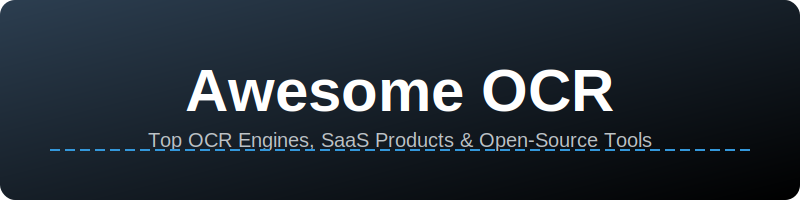

# 🚀 Awesome-OCR: The Ultimate List of OCR Engines & Tools

  

  
  
  
  

---

**Curated List of SaaS Products & Open-Source GitHub Projects**  
*Focused on Optical Character Recognition (OCR), Document Intelligence, & Intelligent Document Processing (IDP)*  
**📅 Last updated: June 2026**

---

## 📖 Overview

This repository tracks notable **SaaS platforms** and **open-source projects** building next-generation **OCR Engines & Tools**. These solutions extract text from scanned documents, images, PDFs, handwritten notes, and complex layouts with high accuracy, layout analysis, and multilingual support.

**Key Categories:**
- 🖼️ **Image-to-Text:** Extracting raw text from photos and scans.
- 📄 **Document Intelligence:** Structured data extraction (Forms, Tables, Invoices).
- ✍️ **Handwriting Recognition:** Converting script to digital text.
- 🌍 **Multilingual OCR:** Support for 100+ languages including Latin, CJK, and Arabic scripts.

---

## 🗺️ Table of Contents
- [🏢 SaaS Products](#-saas-products)
- [💻 Open-Source GitHub Projects](#-open-source-github-projects)
- [🤝 How to Contribute](#-how-to-contribute)
- [⚖️ Disclaimer](#-disclaimer)

---

## 🏢 SaaS Products

### OCR SaaS Pricing & Market Comparison (2026) 📊

| Product | Description | Company Size (Revenue/Valuation) | Pricing (Paid Tier) | Free Tier Limit |
| :--- | :--- | :--- | :--- | :--- |
| **[Amazon Textract](https://aws.amazon.com/textract/)** | Specialized in extracting text, tables, and forms from structured documents. | **$716B+** (Annual Revenue) | $0.0015 - $0.015 per page | **1,000 pages/month** (First 3 months) |
| **[Google Cloud Vision](https://cloud.google.com/vision)** | General-purpose OCR with excellent multilingual support and handwriting recognition. | **$422B+** (Annual Revenue) | ~$1.50 per 1,000 units | **1,000 units/month** (Free forever) |
| **[Microsoft Azure AI Vision](https://azure.microsoft.com/en-us/products/ai-services/ai-vision)** | Enterprise OCR with layout analysis and seamless Azure integration. | **$281B+** (Annual Revenue) | ~$1.50 per 1,000 transactions | **5,000 transactions/month** (F0 tier) |
| **[Nanonets](https://nanonets.com/)** | AI-driven IDP platform for automated invoice and receipt processing. | **~$1.8B** (Valuation) | $0.30/page + $499/mo starter | **500 pages** (One-time trial) |
| **[ABBYY Vantage](https://www.abbyy.com/vantage/)** | High-accuracy enterprise Intelligent Document Processing (IDP). | **~$1.6B** (Valuation) | Custom (~$0.02/page + setup) | **2,000 pages** (60-day trial) |
| **[Rossum](https://rossum.ai/)** | AI-native document extraction (acquired by Coupa Software). | **~$1B** (Estimated Valuation) | ~$1,500/mo (Annual) | **14-day trial** |
| **[OCR.space](https://ocr.space/)** | Lightweight web-based OCR API with a generous free tier for developers. | **~$35M** (Estimated Valuation) | $30/mo for 300,000 requests | **25,000 requests/month** (Free) |

> 💡 **Pro Tip:** For high-volume raw text extraction, **OCR.space** offers the most generous permanent free tier. For complex forms, **Amazon Textract** is the industry leader.

---

## 💻 Open-Source GitHub Projects

Explore the most powerful open-source OCR engines for local deployment and fine-tuning. 🛠️

- **[PaddleOCR](https://github.com/PaddlePaddle/PaddleOCR)**   
  🏆 **State-of-the-art** toolkit with ultra-high accuracy and support for 80+ languages. Excellent layout analysis.

- **[Tesseract](https://github.com/tesseract-ocr/tesseract)**   
  🏛️ The **gold standard** of open-source OCR. Highly accurate and widely used in production pipelines.

- **[SmolDocling OCR](https://github.com/ds4sd/docling)**   
  ⚡ **High-performance** document understanding optimized for PDFs and structured extraction.

- **[OCRmyPDF](https://github.com/ocrmypdf/OCRmyPDF)**   
  📂 Best tool for adding a **searchable text layer** to existing image-based PDFs.

- **[EasyOCR](https://github.com/JaidedAI/EasyOCR)**   
  🐍 **Python-native** and extremely easy to use. Great for developers who need quick integration.

- **[MiniCPM-o](https://github.com/OpenBMB/MiniCPM-o)**   
  🧠 **Multimodal AI** that can reason over documents and extract text efficiently on local hardware.

- **[TrOCR (Microsoft)](https://github.com/microsoft/unilm/tree/master/trocr)**   
  🤖 **Transformer-based** model for cutting-edge text recognition.

- **[Unstructured](https://github.com/Unstructured-IO/unstructured)**   
  🧩 Essential for **LLM Preprocessing** and extracting elements from complex layouts.

- **[RapidOCR](https://github.com/RapidAI/RapidOCR)**   
  🏎️ **Ultra-fast** engine optimized for mobile and real-time edge deployment.

- **[Pytesseract](https://github.com/madmaze/pytesseract)**   
  🔗 The standard **Python wrapper** for Tesseract-OCR.

- **[DocTR](https://github.com/mindee/doctr)**   
  ✨ End-to-end library with powerful detection and recognition models.

- **[LayoutParser](https://github.com/Layout-Parser/layout-parser)**   
  🗺️ Unified toolkit for **deep learning-based** document layout analysis.

- **[Calamari](https://github.com/Calamari-OCR/calamari)**   
  📜 Specialized in **historical documents** and degraded scan restoration.

- **[Kraken](https://github.com/mittagessen/kraken)**   
  🖋️ Advanced engine for **manuscripts** and complex, non-standard layouts.

- **[LlamaOCR](https://github.com/search?q=LlamaOCR)**  
  🦙 Community-driven solutions using **Llama models** for high-accuracy extraction.

---

## 🤝 How to Contribute

We love contributions! Help us keep this list the most accurate OCR resource on the web.

1. **Fork** the repository.
2. **Add/Edit** entries in `README.md` (keep descriptions concise).
3. **Badge Check:** If adding an OS project, include the star badge!
4. **PR:** Submit a Pull Request with a short summary of your changes.

---

## ⚖️ Disclaimer

- This is a **community-curated** list — not exhaustive and not an endorsement.
- OCR accuracy varies by document quality and language. Always validate critical data.
- Self-hosted solutions may require GPU acceleration for peak performance.

---

## 📈 Star History

   <a href="https://www.star-history.com/?repos=ishandutta2007%2FAwesome-OCR&type=date&legend=bottom-right">
    <picture>
      <source media="(prefers-color-scheme: dark)" srcset="https://api.star-history.com/chart?repos=ishandutta2007/Awesome-OCR&type=date&theme=dark&legend=bottom-right" />
      <source media="(prefers-color-scheme: light)" srcset="https://api.star-history.com/chart?repos=ishandutta2007/Awesome-OCR&type=date&legend=bottom-right" />
      
    </picture>
   </a>

---

  <b>Made with ❤️ for the Document Intelligence Community.</b> 
  Let's make text extraction accurate, accessible, and open.

